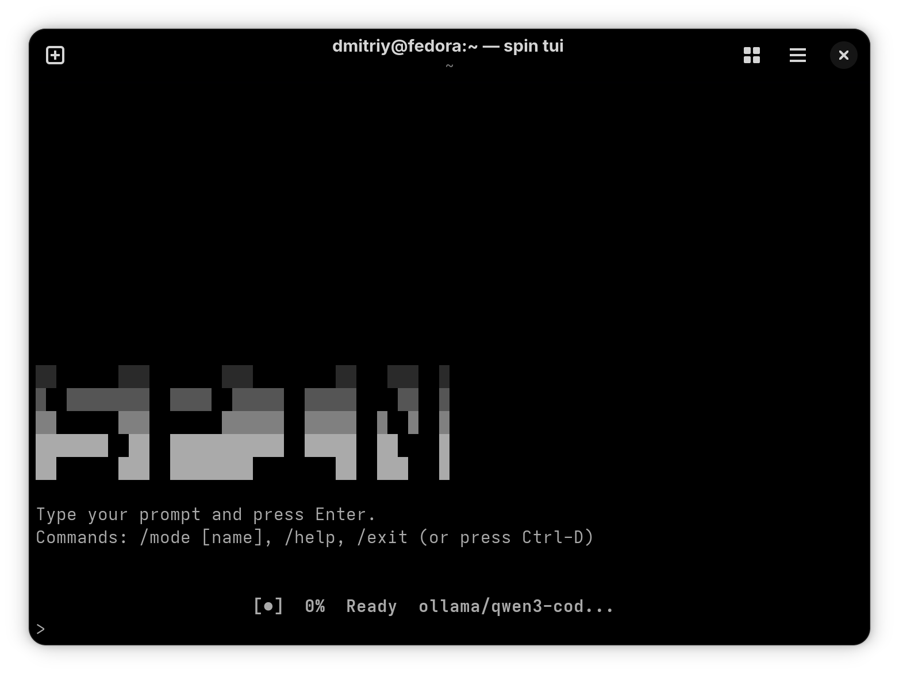

# spin(1)



## NAME

spin - AI-powered coding agent with tool execution and security sandboxing

## SYNOPSIS

```
spin [--provider PROVIDER] [--model MODEL] [--mode MODE]
spin exec [--auto-approve] PROMPT
spin config [show|set KEY VALUE]
spin mcp list|add|remove
```

## DESCRIPTION

Spin is an autonomous AI agent that executes code operations through LLM tool calling. Built in Go, it provides multi-provider LLM support, filesystem sandboxing, and a terminal UI with native scrollback.

Key characteristics:
- Service-oriented architecture with dependency injection
- Builder pattern for conversation construction
- Security-first design with command validation and process isolation
- Type-safe tool system using Go generics

## INSTALLATION

Build from source:

```bash
git clone https://github.com/dmytrogajewski/spin.git
cd spin
make build
./bin/spin
```

Requirements: Go 1.23+, Linux kernel 5.13+ (for Landlock) or macOS 10.15+

## USAGE

Interactive mode:

```bash
spin
> implement user authentication with JWT
> /mode review
> analyze security of auth.go
> /resume          # list previous sessions
> /resume last     # continue the newest one
```

Non-interactive execution:

```bash
spin exec "run tests and fix failures"
spin exec --auto-approve --provider openai "refactor main.go"
```

## SEE ALSO

How-to (landed operator surfaces):

- [docs/how-to/agent-skills.md](docs/how-to/agent-skills.md) — write a skill, `/skills`, `skill` tool
- [docs/how-to/agent-plugins.md](docs/how-to/agent-plugins.md) — `plugin.json`, containment, MCP isolation
- [docs/how-to/subagents.md](docs/how-to/subagents.md) — spawn, wait, cancel, local A2A

Reference: [docs/reference/compact.md](docs/reference/compact.md), [docs/reference/hooks.md](docs/reference/hooks.md). Testing: [docs/testing.md](docs/testing.md).

## ARCHITECTURE

```
Application Layer (cmd/spin)
    ├─ Creates services (git, shell, mcp)
    ├─ Builds conversation via Builder
    └─ Manages service lifecycle

Conversation Layer (internal/conversation)
    ├─ Builder: fluent API for construction
    ├─ Agent: LLM interaction and tool orchestration  
    ├─ History: message management
    └─ Events: async event streaming

Service Layer
    ├─ git.Service:   Git operations wrapper
    ├─ shell.Service: Shell command execution
    └─ mcp.Service:   Model Context Protocol tools

Tool System (internal/tools)
    ├─ Registry: tool registration and lookup
    ├─ Approval: security validation
    └─ Built-in: read_file, write_file, shell_command, etc.

Security (internal/security)
    ├─ Validator: command classification (safe/dangerous/forbidden)
    ├─ Sandbox: Landlock LSM on Linux, Seatbelt on macOS
    └─ Hardening: disable core dumps, ptrace, sanitize env
```

Service lifecycle:
1. Application creates services (git, shell, mcp)
2. Services passed to Builder via WithGit(), WithShell(), WithMCP()
3. Builder.Build() constructs Conversation with injected services
4. Application owns services, handles cleanup on exit

## TASK MODES

Four execution modes with different token budgets and tool access:

```
MODE      TOKENS  TOOLS      USE CASE
regular   16K     all        Feature implementation, debugging
review    12K     read-only  Code review, security audit
compact   4K      minimal    Quick queries, documentation lookup
planning  4K      context    Architecture planning, task breakdown
```

Mode switching:

```bash
# At startup
spin --mode review

# Interactive
> /mode compact
> /mode
Current mode: compact
```

## CONFIGURATION

Configuration file: `~/.spin/config.yaml`

```yaml
provider: anthropic
model: claude-3-5-sonnet-20241022
temperature: 0.7
max_turns: 50

enable_git: true
enable_shell: true
enable_mcp: false

shell_timeout: 30s

cycle_detection:
  enabled: true
  max_turns: 10
```

Provider authentication via environment variables:

```bash
export OPENAI_API_KEY=sk-...
export ANTHROPIC_API_KEY=sk-ant-...
export GOOGLE_API_KEY=...
```

## SECURITY

Command validation enforces safety levels:

- Safe: read operations auto-approved (ls, cat, grep)
- Interactive: write operations require approval (write_file, git commit)
- Dangerous: destructive operations require explicit approval (rm -rf, git push --force)
- Forbidden: never executed (dd, mkfs, :(){ :|:& };:)

Filesystem sandboxing:

Linux (Landlock LSM):
```
Allows: workspace read/write
Denies:  /etc, /sys, /proc, /dev (except /dev/null, /dev/urandom)
```

macOS (Seatbelt):
```
Allows: workspace, /tmp, user home (read)
Denies:  system directories, network access
```

Process hardening:
- RLIMIT_CORE = 0 (disable core dumps)
- PR_SET_DUMPABLE = 0 (disable ptrace attach)
- Sanitized PATH and env vars
- Dropped capabilities on Linux

## TERMINAL UI

Native scrollback terminal interface without alternate screen buffer.

Features:
- Append-only transcript (factory droid principle)
- Block-based timeline for agent actions
- Real-time streaming (8.7M chunks/sec coalescing)
- Native PgUp/PgDn navigation
- Works in SSH, tmux, screen

Block types:
- EXECUTE: tool execution with results
- PLAN: agent reasoning
- DIFF: file modifications
- SUMMARY: turn completion

Performance: 100k+ blocks, 0.52ms viewport render

## LLM PROVIDERS

Supported providers:

```bash
# OpenAI
spin --provider openai --model gpt-4-turbo

# Anthropic
spin --provider anthropic --model claude-3-5-sonnet-20241022

# Ollama (local)
spin --provider ollama --model llama3.1:70b

# LM Studio (local)
spin --provider lmstudio --model local-model
```

Provider requirements:
- Streaming support
- Tool/function calling
- JSON mode for structured output

## TOOL SYSTEM

Built-in tools:

```
read_file(path)              - Read file contents
write_file(path, content)    - Write/overwrite file
list_directory(path)         - List directory contents
shell_command(command)       - Execute shell command (sandboxed)
apply_patch(patch)           - Apply unified diff
file_search(pattern)         - Search files by pattern
git_operation(operation)     - Git operations (status, diff, commit)
get_context()                - Get workspace context
```

Tool execution flow:
1. LLM returns tool call
2. Validator classifies command
3. Approval handler checks policy
4. Tool executor runs in sandbox
5. Result returned to LLM

Custom tools via MCP (Model Context Protocol):

```bash
spin mcp add sqlite ~/mcp-servers/sqlite
spin mcp list
```

## DEVELOPMENT

Project structure:

```
cmd/spin/          - CLI application, service creation
internal/
  agent/           - LLM interaction and tool orchestration
  conversation/    - Conversation builder and management
  config/          - Configuration types
  git/             - Git service wrapper
  shell/           - Shell service wrapper
  mcp/             - MCP service wrapper
  tools/           - Tool registry and implementations
  security/        - Validation, sandboxing, hardening
  llm/             - Provider implementations
  ui/              - Terminal UI components
```

Testing:

```bash
make test              # Run all tests
make test-coverage     # Generate coverage report
make lint              # Run linters and deadcode analysis
```

Code coverage target: 85%+
No dead code allowed (enforced by make test)

Builder pattern example:

```go
cfg := config.DefaultConfig()
cfg.Provider = "anthropic"
cfg.Model = "claude-3-5-sonnet-20241022"

workDir := "/path/to/workspace"
llmProvider := llm.NewAnthropicProvider(apiKey)

conv, err := conversation.NewBuilder(cfg, workDir).
    WithLLM(llmProvider).
    WithGit(gitService).
    WithShell(shellService).
    Build(ctx)
```

## FILES

```
~/.spin/config.yaml       - Configuration file
~/.spin/sessions/         - Session storage
~/.spin/ace/              - ACE learning bullets
/tmp/spin-sandbox-*       - Temporary sandbox directories
```

## ENVIRONMENT

```
OPENAI_API_KEY            - OpenAI API authentication
ANTHROPIC_API_KEY         - Anthropic API authentication
GOOGLE_API_KEY            - Google AI authentication
SPIN_CONFIG               - Override config file path
SPIN_DEBUG                - Enable debug logging
```

## EXIT STATUS

```
0    Success
1    General error
2    Configuration error
130  Interrupted (SIGINT)
```

## EXAMPLES

Fix all test failures:

```bash
spin exec "run go test ./... and fix all failures"
```

Review code for security issues:

```bash
spin --mode review
> Audit auth/ directory for security vulnerabilities
```

Refactor with git commit:

```bash
spin exec "refactor parseConfig to use functional options pattern and commit with descriptive message"
```

## BUGS

Report issues at: https://github.com/dmytrogajewski/spin/issues

Documentation: docs/
Examples: examples/

## AUTHORS

Built with Go 1.23+ following clean architecture principles.

## LICENSE

MIT License
